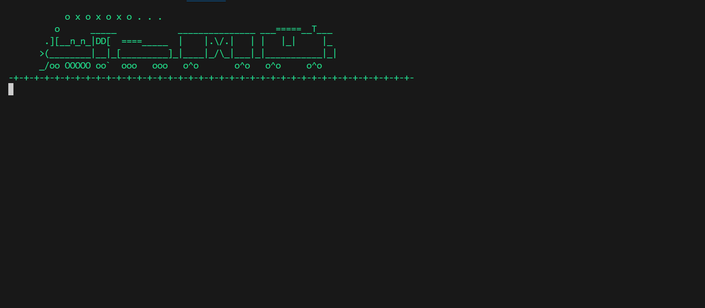
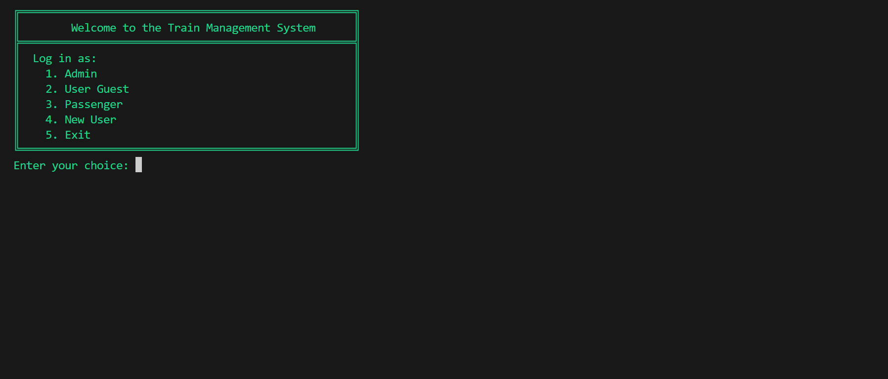
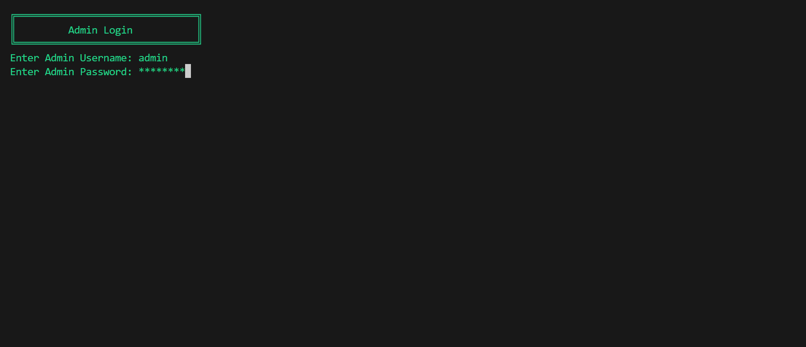
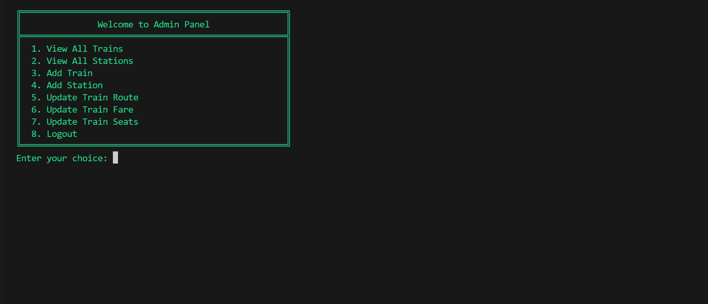
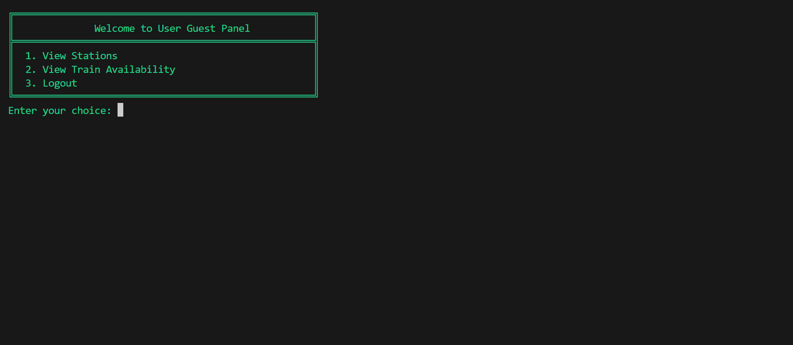
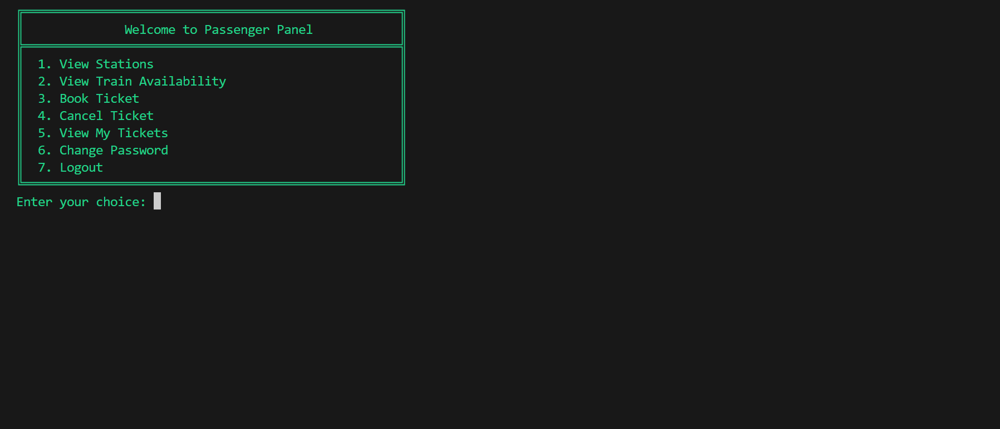
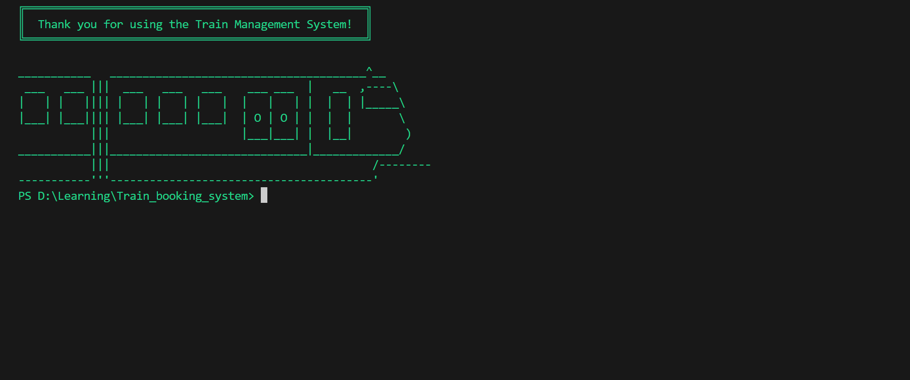

# Train Booking System

A console-based Train Booking System developed in C++ using Object-Oriented Programming principles. The project allows different user types—Admin, Passenger, and Guest—to interact with a virtual train reservation system.

---

## Disclaimer

This program is a simulation and **does not perform real-life ticket bookings**. All entities used are for educational/demo purposes only.

---

## Key Features

- **Admin Panel**
  - Add/view stations and trains
  - Update train route, fare, and seat capacity
- **Passenger Panel**
  - View train availability
  - Book/cancel tickets
  - View booked tickets
  - Change account password
- **Guest Panel**
  - View stations and train availability (no booking allowed)
- **User Authentication**
  - Encrypted credentials saved in `credentials.csv`
- **Persistent Data**
  - CSV-based file storage for passengers, trains, stations, classes, tickets

---

## Pending Feature

- The functionality for **printing tickets in HTML format** is partially implemented.
- The **function definition and function calls are already present**, but the internal logic to generate and save the HTML ticket is **yet to be written**.

---

## Concepts Used

- Object-Oriented Programming (OOP)
- File Handling with CSV
- Custom Console UI Design
- Data Encryption
- Input Validation and Masked Password Input
- Data Structures

---

## How to Run

1. **Clone the repository**

   ```bash
   git clone https://github.com/Vishwasdabhi/Train_booking_system
   cd Train_booking_system
   ```

2. **Compile the code (Windows only)**

   ```bash
   g++ driver.cpp -o train_booking.exe
   ```

3. **Run the program**
   ```bash
   ./train_booking.exe
   ```

> The project uses Windows-specific features like `_getch()` and `system("cls")`. Use **Command Prompt** or **PowerShell** for best experience.

---

## Project Structure

| File         | Purpose                                |
| ------------ | -------------------------------------- |
| `driver.cpp` | Entry point with UI panels             |
| `classes.h`  | All core classes (Train, Ticket, etc.) |
| `backend.h`  | File handling (load/save functions)    |
| `frontend.h` | UI-related functions                   |
| `*.csv`      | Stores persistent data                 |

---

## CSV Files Used

- `stations.csv`
- `trains.csv`
- `tickets.csv`
- `passengers.csv`
- `travel_classes.csv`
- `credentials.csv`

These are automatically loaded/saved using backend functions.

---

## Users

### Admin

- Can manage trains, stations, fare, seats, and routes.

### Passenger

- Login with username/password
- Can book, view, or cancel tickets

### Guest

- Can explore trains and stations but **cannot book**

---

## Console UI Highlights

- Clean boxed UI using Unicode characters
- Password inputs are masked
- Improved user prompts for better interactivity

---

## Screenshots

Add terminal screenshots like:

- Enter Screen

- Login Page

- Masked input

- Admin Panel

- User Guest Panel

- Passenger Panel

- Exit Screen


---

## Resources Used

- ASCII Box Drawing: Unicode Box Drawing Characters
- ASCII Art for Train : [asciiart.eu](https://www.asciiart.eu/vehicles/trains)
